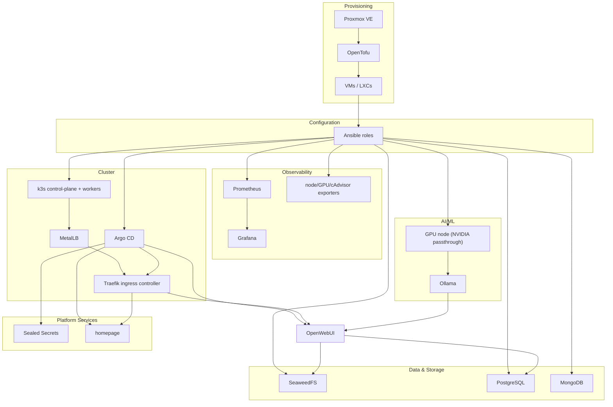

# homelab

A fully automated, GitOps-managed homelab running on bare-metal Proxmox — from hypervisor to running workloads with no manual clicking.


[](https://github.com/ryikeda/homelab/actions/workflows/ci.yml)

## Overview

This repository is the single source of truth for a homelab running on a Proxmox VE hypervisor: every VM and container, every host configuration, and every workload is declared in code and reconciled automatically. [OpenTofu](iac/opentofu) provisions compute on Proxmox; [Ansible](iac/ansible) bootstraps and configures each host, then stands up a [k3s](https://k3s.io/) cluster; [Argo CD](iac/argocd) takes over from there, syncing every in-cluster workload straight from git via an app-of-apps pattern. The result demonstrates declarative infrastructure provisioning, idempotent configuration management, GitOps-driven continuous deployment, fleet-wide observability, and GPU-accelerated local LLM inference — all gated by CI linting on every change.

## Architecture



## Tech stack

Only what's actually deployed in this repo — nothing aspirational.

| Category | Tools |
|---|---|
| Provisioning | Proxmox VE, OpenTofu (`bpg/proxmox` provider) |
| Config Management | Ansible (`ansible-core`, run via `uv`) |
| Orchestration | k3s, Helm, MetalLB |
| GitOps | Argo CD (app-of-apps), Sealed Secrets |
| Networking | OPNsense (firewall, DHCP, DNS resolver), Traefik (edge LXC + in-cluster ingress), Technitium DNS |
| Storage | SeaweedFS (S3-compatible), PostgreSQL, MongoDB, CloudBeaver |
| Observability | Prometheus, Grafana, node_exporter, nvidia_gpu_exporter, cAdvisor, pve_exporter |
| AI/ML | Ollama, OpenWebUI, NVIDIA GPU passthrough (vfio-pci + Container Toolkit CDI) |
| Container Management | Portainer, Dockge |
| Media | Jellyfin (NVENC hardware transcoding) |
| CI | GitHub Actions, ansible-lint, yamllint, `tofu fmt`/`validate`, `helm lint` |

## How it works

1. **OpenTofu provisions VMs/LXCs on Proxmox** by cloning a pre-built cloud-init template (created once by the `proxmox_vm_template`/`proxmox_lxc_template` Ansible roles). `capacity_checks.tf` hard-blocks the apply if the datastore is ≥95% full or the node has <10% memory free, and warns earlier at looser thresholds.
2. **Each resource's `local-exec` provisioner converges that host itself**: it waits for SSH, then chains `ansible-playbook` runs against just that host — `bootstrap.yml` (baseline access) followed by the service-specific playbook (`gpu_services.yml`, `database_services.yml`, `monitoring.yml`, ...) and `dns_records.yml` to register it in Technitium.
3. **`gondor` (the k3s control-plane) goes further in the same provisioner run**: `k3s_cluster.yml` → `metallb_install.yml` → `argocd_install.yml`, so a single `tofu apply` takes the cluster from nothing to fully GitOps-managed with no manual follow-up.
4. **`argocd_install` also applies `iac/argocd/root.yaml`**, the app-of-apps `Application` that watches `iac/argocd/apps/`.
5. **From there, Argo CD takes over**: it polls the repo and auto-syncs (`prune` + `selfHeal`) everything under `apps/` — the Sealed Secrets controller, the in-cluster Traefik ingress controller (MetalLB-assigned LoadBalancer IP), and workloads (`homepage`, `openwebui`).
6. **The standalone Traefik LXC is the single LAN entry point** (real Let's Encrypt certs via Cloudflare DNS-01); it forwards k8s-hosted hostnames to the in-cluster ingress controller's MetalLB IP, which routes by `Host` header via `IngressRoute` to the right service.
7. **Secrets never touch git in plaintext**: anything sensitive is encrypted client-side with `kubeseal` and committed as ciphertext (`SealedSecret`) — only the in-cluster controller's private key, persisted across cluster rebuilds, can decrypt it back into a real `Secret`.

## Repository layout

```
iac/
├── opentofu/   # Provisions Proxmox VMs/LXCs (OpenTofu, bpg/proxmox provider)
├── ansible/    # Host bootstrap, service configuration, k3s/MetalLB/Argo CD install
└── argocd/     # GitOps manifests: app-of-apps root + one Helm chart per workload
.github/workflows/  # CI: ansible-lint, yamllint, tofu fmt/validate, helm lint
```

## Engineering highlights

- **App-of-apps GitOps** — `iac/argocd/root.yaml` watches `iac/argocd/apps/` and auto-applies (`prune`+`selfHeal`) whatever shows up; adding a workload is a new chart + a new `Application` file, no manual `kubectl`.
- **Sealed Secrets with cluster-key persistence** — the controller's signing key is backed up to the Ansible controller and automatically restored into a rebuilt cluster, so previously-committed `SealedSecret`s stay decryptable across a full `tofu destroy`/`apply` cycle.
- **GPU passthrough for local LLM inference** — the GPU box's NVIDIA card is bound to `vfio-pci` and exposed to the VM via a named Proxmox resource mapping (`hostpci0`), then surfaced to containers through the NVIDIA Container Toolkit's CDI spec for Ollama (and NVENC-accelerated Jellyfin transcoding).
- **Fleet-wide observability** — Prometheus + Grafana on a dedicated monitoring VM, scraping `node_exporter` cluster-wide plus `nvidia_gpu_exporter`, `cAdvisor`, and `pve_exporter` for GPU, container, and hypervisor metrics respectively.
- **Proactive capacity gates** — OpenTofu `check` blocks and `lifecycle.precondition`s refuse to apply against a nearly-full datastore or memory-starved Proxmox node, instead of failing mid-provision.
- **Self-converging provisioners** — each VM/LXC's `local-exec` chains the exact Ansible playbooks needed to take it from bare clone to fully running service, so `tofu apply` alone is the entire path from provisioning to service.
- **CI across every IaC layer** — `ansible-lint`/`yamllint` for Ansible, `tofu fmt`/`validate` for OpenTofu, `helm lint`/`yamllint` for the Argo CD charts, all gating every pull request.
- **Reproducible tooling** — `iac/ansible/uv.lock` pins the exact Python/Ansible toolchain so playbook runs aren't dependent on whatever happens to be on the operator's machine.

## Getting started

**Prerequisites**: a Proxmox VE host, [`uv`](https://docs.astral.sh/uv/), [OpenTofu](https://opentofu.org/) (see `iac/opentofu/versions.tf` for the pinned provider), an `ansible`/`ansible.pub` SSH keypair, and `helm`/`kubeseal` if you'll touch the GitOps layer.

```sh
# 1. Configure Ansible
cd iac/ansible
uv sync
uv run ansible-galaxy collection install -r collections/requirements.yml -p collections
cp inventories/homelab/group_vars/all/local.yml.example inventories/homelab/group_vars/all/local.yml
# edit local.yml with real host IPs/credentials — it's gitignored

# 2. Bootstrap and configure the Proxmox host itself
uv run ansible-playbook playbooks/bootstrap.yml --limit pve -u root -e ansible_password='<root-password>'
uv run ansible-playbook playbooks/proxmox.yml
```

```sh
# 3. Provision everything else with OpenTofu
cd iac/opentofu
cp terraform.tfvars.example terraform.tfvars
# edit terraform.tfvars with real static IPs
export PROXMOX_VE_ENDPOINT="https://<pve-host>:8006"
export PROXMOX_VE_API_TOKEN="opentofu@pve!provider=<token>"   # minted by proxmox_opentofu_user
tofu init
tofu apply
```

`tofu apply` triggers every host's own bootstrap-through-service Ansible chain (see [How it works](#how-it-works)) — by the time it completes, the k3s cluster is up and Argo CD is syncing `iac/argocd/apps/` on its own. See [`iac/ansible/README.md`](iac/ansible/README.md) and [`iac/argocd/README.md`](iac/argocd/README.md) for the full per-service breakdown.
